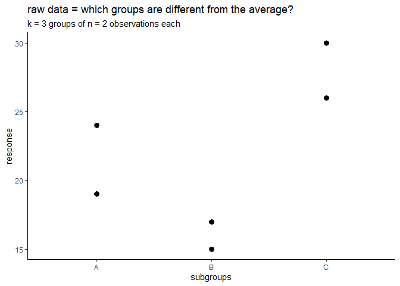
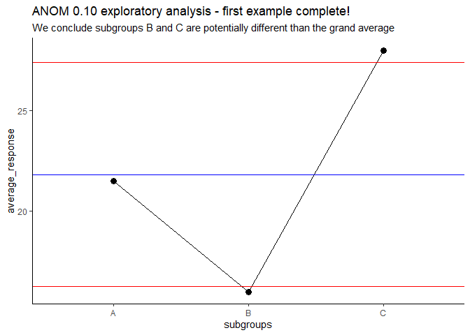

range based ANOM
================
Ben Jepson
2023-09-23

## One way analysis of means

Based on Donald Wheeler’s book “Analyzing Experimental Data”

Yes there is an R ANOM package already. It’s not set up how I would
want. It’s different.

rbANOM will use the range based method. I plan to implement this for
python too, as it doesn’t look like ANOM is available (yet?).

I’ll write some good documentation later. The book already covers
everything. Not everyone has the book…and I don’t think most people know
about ANOM.

### Some background

For the essentials, we will consider **k** subgroups of size **n**. We
will compare the results in each subgroup to the grand average.

For example, we have 2 groups (subgroups): subgroup **A** and subgroup
**B**. Each subgroup has 2 observations (measurements, responses, many
ways to say it).

Here you go

``` r
simple_example <- data.frame(subgroups = c("A", "A", "B", "B"), 
                             response  = c(24, 19, 15, 17))

print(simple_example)
```

    ##   subgroups response
    ## 1         A       24
    ## 2         A       19
    ## 3         B       15
    ## 4         B       17

**k is 2** (A and B) **n is 2** (2 responses in A (24 & 19), 2 responses
in B(15 & 17)) (what if n is not the same for all groups? The method
changes a bit and we’ll deal with that later.)

3 subgroups might make a better example:

``` r
simple_example <- data.frame(subgroups = c("A", "A", "B", "B", "C", "C"), 
                             response  = c(24, 19, 15, 17, 26, 30))

print(simple_example)
```

    ##   subgroups response
    ## 1         A       24
    ## 2         A       19
    ## 3         B       15
    ## 4         B       17
    ## 5         C       26
    ## 6         C       30

**k is 3** subgroups (A, B, C) **n is 2** (2 responses in A (24 & 19), 2
responses in B(15 & 17), 2 responses in C(26, 30))

ANOM is a graphical method, we will plot the average response for each
subgroup on Y axis, subgroup on X axis, centerline for response Grand
Average, and Upper & Lower Decision limits. The averages are connected
with lines.

Alpha chosen reflects your attitude/approach to the analysis:
conservative(0.01), traditional(0.05), exploratory(0.10)

### Steps

rearrange and clarify later I know it’s messy. Trying to just
ggggggetttttttt moooooooving Should the calculations end up in an object
later? There are several values to collect for use

function might look something like this (could use formula interface?
Maybe later?)

rbANOM::rbANOM(data, groupvariable = \_\_\_\_\_\_, response =
\_\_\_\_\_\_\_, alpha = (pick one: 0.01, 0.05, 0.10))

- Check the response is **numeric** (if not stop and return error)
- count unique values in groupvariable = **k**
- group by groupvariable and count response in each = **n**
- IF all n are the same, proceed with equal subgroup ANOM (what we’re
  doing now)
- IF all n are not the same, proceed with unequal subgroup ANOM (LATER
  LATER LATER)
- calculate grand average: mean(response) = **grand_average**
  (UNgrouped! Do it first before grouping? best way to manage?)
- calculate ranges for each subgroup: grouped by groupvariable,
  **subgroup_range** = max(response) - min(response)
- calculate average range: mean(subgroup_range) = **average_range**
- LOOKUP ANOM alpha value from table: with k = 3, and n = 2, let’s say
  alpha = 0.10, then it’s 1.515 (Will need to create tables and look up
  results based on alpha provided and k & n calculated)

``` r
mean(simple_example$response)
```

    ## [1] 21.83333

grand_average = 21.8333

``` r
setDT(simple_example)
simple_example[ , 
                .(subgroup_range = max(response) - min(response)),
                  by = .(subgroups)]
```

    ##    subgroups subgroup_range
    ## 1:         A              5
    ## 2:         B              2
    ## 3:         C              4

average_range = mean(subgroup_range) = (5 + 2 + 4) / 3 = **3.6667**

Upper detection limit **UDL** = grand_average + (ANOMalpha \*
average_range) = 21.8333 + (1.515 \* 3.6667) = 27.388 Lower detection
limit **LDL** = grand_average - (ANOMalpha \* average_range) = 21.8333 -
(1.515 \* 3.6667) = 16.278

### Plotting the results

First let’s look at the raw data

``` r
ggplot(simple_example, 
       aes(x = subgroups, y = response))+
    geom_point(size = 3)+
    labs(title = "raw data = which groups are different from the average?", 
         subtitle = "k = 3 groups of n = 2 observations each")
```

<!-- -->

``` r
simple_example_to_plot <- simple_example[ , 
                                          .(average_response = mean(response)), 
                                          by = subgroups]


ggplot(simple_example_to_plot, 
       aes(x = subgroups, y = average_response))+
    geom_point(size = 3)+
    geom_line(group = 1)+
    geom_hline(yintercept = 21.833, color = "blue")+
    geom_hline(yintercept = 27.388, color = "red")+
    geom_hline(yintercept = 16.278, color = "red")+
    labs(title = "ANOM 0.10 exploratory analysis - first example complete!", 
         subtitle = "We conclude subgroups B and C are potentially different than the grand average")
```

<!-- -->

These results will need to be replicated and continue to show this
signal to confirm B and C really are different than the average.
